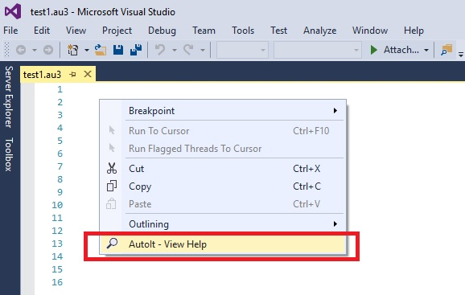

# AutoItViewHelp

<!-- VS Gallery link requires an update after you've uploaded a new VSIX file-->
###Download now also available on the Microsoft [VS Gallery](https://visualstudiogallery.msdn.microsoft.com/ab30dfbb-5a2d-4552-9d78-618df17f023f).
###Latest update information can be found here: [Changelog](Changelog.md).

Visual Studio extension to easily view the AutoIt help file on context menu for ".au3" file types.

## Precondition
Please make sure that you also have the AutoIt software package installed before using this extension.

You can download it here: [AutoIt](https://www.autoitscript.com/site/autoit/downloads) 

## Features
Open ".au3" files in Visual Studio and use **with this** extension the **context menu** to get the help file displayed.

## Contribution
Check out the [contribution guidelines](Contributing.md)
if you want to contribute to this project.

For cloning and building this project yourself, please make sure
to install the
[Extensibility Tools 2015](https://visualstudiogallery.msdn.microsoft.com/ab39a092-1343-46e2-b0f1-6a3f91155aa6)
extension for Visual Studio which enables some features
used by this project.

## License
[Apache 2.0](LICENSE)
